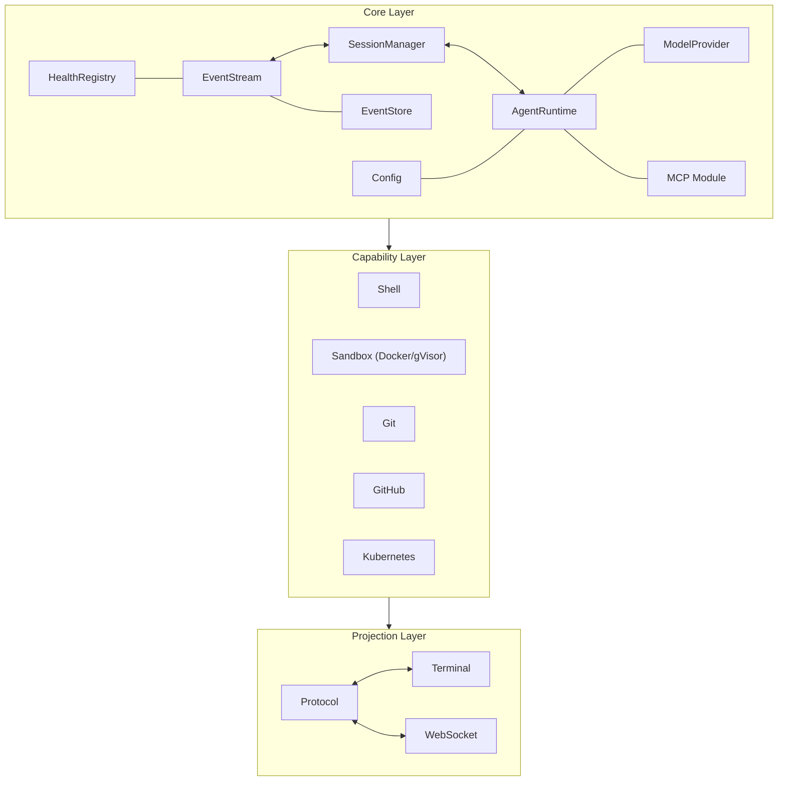

# kayak-lab

Event-sourced agent interaction platform built with Deno 2.

Decouples an AI agent runtime from multiple UI surfaces (CLI, VS Code, Web, Desktop, API) using immutable event streams as the canonical representation of agent interactions. UIs become disposable projections — reconstructable from events at any time.

## Architecture



## Core Concepts

### Event Sourcing

Every agent interaction is captured as an ordered stream of immutable events. Events are the canonical representation — UIs, tools, and debugging all read from the same event stream.

```
Session "abc-123":
  1  session.created     { state: "active" }
  2  ui.user.input       { text: "run ls -la" }
  3  agent.thinking      { reasoning: "User wants to list files..." }
  4  tool.execution.started  { tool: "shell", command: "ls -la" }
  5  tool.execution.completed  { exit_code: 0, stdout: "..." }
  6  model.response      { content: "Here are the files..." }
  7  session.completed   { state: "completed" }
```

### Sessions

Sessions manage the lifecycle of agent interactions:

```
  active ──→ paused ──→ active    (interruptible)
    │
    ├──→ completed                 (success)
    ├──→ failed                    (error)
    └──→ cancelled                 (user abort)
```

### Capabilities

Abstract interfaces for external systems. Capabilities are pluggable — swap implementations without changing the agent runtime.

| Capability | Status | Description |
|-----------|--------|-------------|
| Shell | Real execution | `Deno.Command` with safety constraints |
| Sandbox | Real execution | Docker/gVisor with default-deny security |
| Git | Stubbed | Interface defined, returns simulated data |
| GitHub | Stubbed | Interface defined, returns simulated data |
| Kubernetes | Stubbed | Interface defined, returns simulated data |

### Projections

UI surfaces subscribe to the event stream and render events appropriately. Each projection is independent — multiple projections can run simultaneously on the same event stream.

| Projection | Status | Description |
|-----------|--------|-------------|
| Terminal | Implemented | ANSI-colored event rendering with streaming display |
| WebSocket | Implemented | Real-time event delivery with gap recovery |
| Protocol | Implemented | Subscription management with filtering and reconnection |

## Project Structure

```
src/
├── types/                  Event schema and type definitions
│   └── events.ts           BaseEvent, EventTypes registry, type guards
├── core/                   Core infrastructure
│   ├── event-stream.ts     Immutable, ordered event stream with session isolation
│   ├── session-manager.ts  Session lifecycle state machine
│   ├── health.ts           HealthRegistry, HTTP health endpoints
│   ├── component-health.ts Component health check registrations
│   ├── config.ts           YAML config loading, validation, secret masking
│   ├── rate-limiter.ts     Token bucket rate limiter
│   ├── bounded-queue.ts    Queue with overflow policies
│   ├── circuit-breaker.ts  Circuit breaker pattern
│   ├── retry.ts            Retry with backoff
│   ├── fallback.ts         Graceful degradation
│   ├── errors.ts           Typed error hierarchy
│   └── schema-registry.ts  Event schema versioning and migration
├── runtime/                Agent execution
│   ├── agent-runtime.ts    Agent loop: input → model → tool cycle
│   ├── model-provider.ts   Provider-agnostic model interface
│   └── tool-registry.ts    Typed tool registration and invocation
├── tools/                  Structured tool calling protocol
│   ├── types.ts            ToolHandlerContext, ToolDefinition interfaces
│   ├── tool-definition.ts  JSON Schema parameter validation
│   ├── calling-engine.ts   Structured tool execution engine
│   ├── registry.ts         Tool enable/disable lifecycle and discovery
│   ├── authoring.ts        Proposal/review/accept/reject tool creation
│   └── self-improvement.ts Usage tracking and suggestion generation
├── capabilities/           External system interfaces
│   ├── capability.ts       ICapability interface, registry
│   ├── shell.ts            Shell execution via Deno.Command
│   ├── sandboxed-shell.ts  Sandboxed execution via ISandboxRuntime
│   ├── sandbox/            Docker/gVisor runtime implementations
│   ├── git.ts              Git operations (stubbed)
│   ├── github.ts           GitHub API operations (stubbed)
│   └── kubernetes.ts       Kubernetes API operations (stubbed)
├── mcp/                    Model Context Protocol integration
│   ├── types.ts            MCP interfaces (transport, client, server, registry, search)
│   ├── transport.ts        Stdio, HTTP, WebSocket transports with factory
│   ├── client.ts           MCPClient with connect, discover, invoke, auto-reconnect
│   ├── server.ts           MCPServer exposing exposable tools to external clients
│   ├── registry.ts         MCPRegistry for external MCP tools with state control
│   ├── search.ts           MCPSearch by name, capability, category
│   ├── events.ts           MCP event types and type guards
│   ├── event-emitter.ts    Wires MCP events to event stream
│   └── mod.ts              Module exports
├── store/                  Event persistence and replay
│   ├── event-store.ts      In-memory event store with snapshots and replay
│   └── persistence.ts      PersistentEventStore with JSONL, snapshots, and recovery
├── projection/             UI projection layer
│   ├── protocol.ts         Subscription protocol with filtering
│   ├── terminal.ts         Terminal/CLI event rendering
│   └── websocket-server.ts WebSocket server for real-time delivery
├── __test-utils__/         Shared test infrastructure
│   ├── mocks/              Mock implementations for all interfaces
│   ├── helpers/            Test builders, generators, assertions
│   ├── fixtures/           JSON test fixtures
│   └── harness/            Integration test environment
└── __tests__/              End-to-end and benchmark tests
```

## Quick Start

```bash
# Run all tests (~160 tests across 40 test files)
deno test --allow-read --allow-env --allow-run

# Type check
deno check src/**/*.ts

# Format
deno fmt

# Lint
deno lint
```

### Sandbox Setup

For sandboxed execution of untrusted code:

```bash
# Install gVisor and configure Docker (requires sudo)
scripts/setup-sandbox.sh

# Verify sandbox is working
scripts/sandbox-health-check.sh
```

### Running Benchmarks

```bash
deno test src/__tests__/benchmarks.test.ts --allow-read --allow-env
```

## Event Types

48 event types across 11 categories:

| Event | Events | Purpose |
|----------|--------|---------|
| Session | `session.created`, `.resumed`, `.paused`, `.completed`, `.failed`, `.cancelled` | Lifecycle management |
| Agent | `agent.thinking`, `.decision`, `.tool_invocation` | Agent loop state |
| Tool | `tool.execution.started`, `.completed`, `.failed` | Tool invocation tracking |
| Model | `model.request`, `.response`, `.stream.delta` | Model provider interaction |
| UI | `ui.user.input`, `.display.update`, `.action` | User interaction |
| Policy | `policy.approval`, `.denial`, `.constraint` | Policy enforcement (planned) |
| Context | `context.window.updated`, `.state.changed` | Context management |
| Self-Observation | `agent.self_observed`, `.pattern_detected` | Agent self-awareness |
| Tool Calling | `tool.call.invocation`, `.result` | Structured tool protocol |
| Tool Authoring | `tool.authored.proposed`, `.created`, `.rejected` | Tool creation lifecycle |
| Tool Self-Improvement | `tool.improvement.suggested`, `.auto_created`, `.auto_improved` | Tool optimization |
| MCP | `mcp.connected`, `.disconnected`, `.tools_discovered`, `.tool.invocation`, `.tool.result`, `.server.started`, `.server.stopped`, `.server.tool.invocation`, `.server.tool.result`, `.tool.registered`, `.tool.unregistered`, `.tool.state_changed`, `.search`, `.search.result`, `.error` | MCP client/server/registry/search operations |

## OpenSpec

This project uses [OpenSpec](https://github.com/allentv/openspec) for specification-driven development. Every feature is specified before implementation.

### Active Changes

| Change | Focus | Status |
|--------|-------|--------|
| `persistence-layer` | File-based event persistence (JSONL, snapshots, recovery) | ✅ Done |
| `real-capabilities` | Real Git/GitHub/K8s execution replacing stubs | In progress |
| `additional-projections` | VS Code, Web, Desktop, REST API projections | In progress |
| `cross-cutting-concerns` | Identity, policy, telemetry, evaluation | In progress |
| `web-monitoring-ui` | Fresh-based monitoring dashboard | In progress |

### Archived Changes

| Change | Focus |
|--------|-------|
| `mcp-servers` | MCP client, server, registry, search with transport abstraction |
| `testing-infrastructure` | Mock registry, test helpers, fixtures, harness |
| `health-checks-observability` | Health probes, component health checks |
| `error-handling-recovery` | Error taxonomy, retry, circuit breaker |
| `schema-evolution` | Event schema versioning and migration |
| `configuration-management` | Typed config with env overrides |
| `rate-limiting-backpressure` | Rate limiters and flow control |
| `websocket-projection` | WebSocket transport for real-time events |
| `local-sandbox-execution` | Docker/GVisor sandbox execution |
| `code-quality-tooling` | Linting, formatting, pre-push checks |
| `documentation-website` | VitePress documentation site |
| `tool-calling` | Structured tool calling protocol with registry, authoring, and self-improvement |

### Working with OpenSpec

```bash
# Check change status
openspec status --change <change-name>

# List all changes
openspec list

# Validate specs
openspec validate <change-name>

# Start implementing a change
openspec instructions apply --change <change-name> --json
```

## Documentation

- [Architecture](docs/architecture.md) — System design and module descriptions
- [Capabilities](docs/capabilities.md) — External system interfaces
- [Changelog](docs/changelog.md) — Version history
- [Learnings](docs/learnings.md) — Patterns, decisions, and gotchas
- [Agents](AGENTS.md) — Code reviewer, scout, and docs-updater configurations

## Development

### Adding a New Capability

1. Define the interface in `src/capabilities/<name>.ts` extending `ICapability`
2. Register it in `src/capabilities/mod.ts`
3. Write tests in `src/capabilities/__tests__/<name>.test.ts`
4. Create an OpenSpec change if the capability has complex behavior

### Adding a New Tool

Tools are created through the `ToolAuthoring` module in `src/tools/authoring.ts`:

1. Propose a tool via `ToolAuthoring.propose(toolName, definition)`
2. The proposal goes through a review cycle (accept/reject)
3. Accepted tools are registered in `ToolRegistry` and become available to `ToolCallingEngine`
4. `ToolSelfImprovement` tracks usage and suggests optimizations

### Adding a New Event Type

1. Add the event type to `EventTypes` in `src/types/events.ts`
2. Add the type guard if needed
3. Update `SCHEMA_VERSION` if this is a breaking change
4. Emit the event from the appropriate module

### Testing Patterns

- `Deno.test` with async `t.step` for nested test organization
- Mock registry in `src/__test-utils__/mocks/` for all interfaces
- Test helpers in `src/__test-utils__/helpers/` for builders and assertions
- Integration harness via `createTestEnvironment()` in `src/__test-utils__/harness/`
- E2E tests wire real components together

## License

ISC
