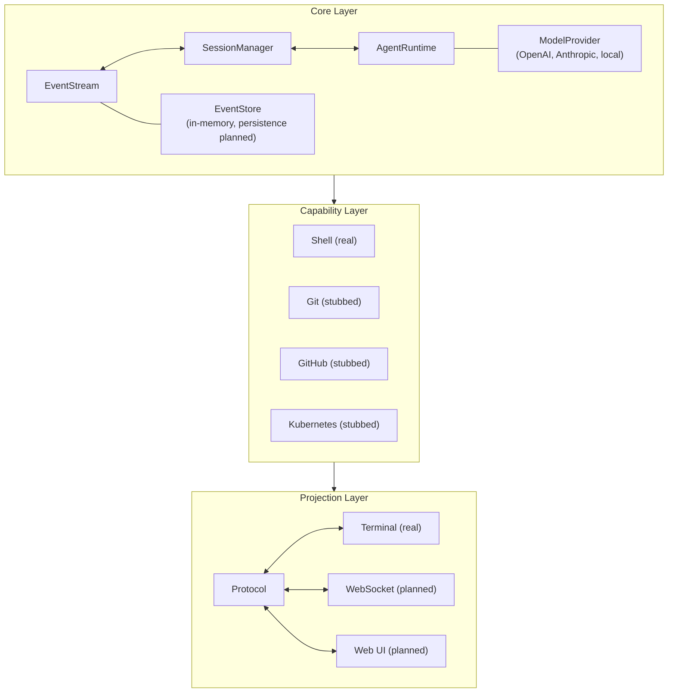
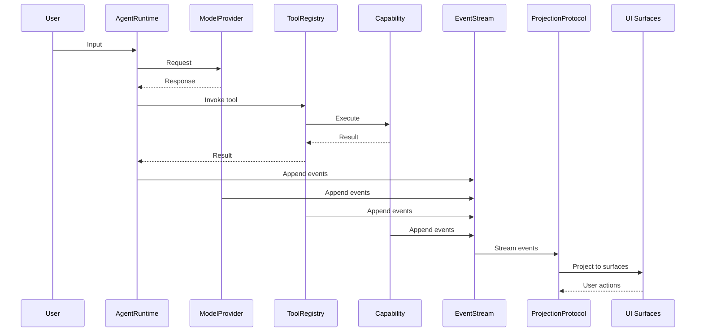

# Architecture

kayak-lab is built as a three-layer architecture: **Core**, **Capabilities**, and **Projections**.



## Core Layer

The foundation of the platform. Handles event storage, session lifecycle, and agent execution.

### EventStream

Immutable, append-only sequence of events. Events are strictly ordered by sequence number within a session. Different sessions are completely isolated.

```typescript
const stream = new EventStream();

// Append an event
const event = stream.append({
  session_id: "abc-123",
  event_type: "session.created",
  payload: { state: "active" },
  metadata: { source: "test" },
});

// Read events for a session
const events = stream.getEvents("abc-123");
```

### SessionManager

Manages session lifecycle with a state machine. All transitions emit typed events.

```typescript
const manager = new SessionManager(eventStream);

// Create a session
const session = await manager.createSession({ description: "My task" });

// Pause and resume
manager.pauseSession(session.id);
manager.resumeSession(session.id);

// Complete
manager.completeSession(session.id);
```

### AgentRuntime

The agent execution loop: input → model → tool cycle. Manages context windows and tool invocations.

```typescript
const runtime = new AgentRuntime(eventStream, sessionManager, modelManager, toolRegistry);

// Start and process input
await runtime.start();
const response = await runtime.processInput("Run ls -la");
```

## Capability Layer

Abstract interfaces for external systems. Capabilities are pluggable and independently testable.

| Capability | Interface | Implementation |
|-----------|-----------|---------------|
| Shell | `IShellCapability` | Real — `Deno.Command` with safety constraints |
| Git | `IGitCapability` | Stubbed — simulated data |
| GitHub | `IGitHubCapability` | Stubbed — simulated data |
| Kubernetes | `IKubernetesCapability` | Stubbed — simulated data |

Capabilities follow a common pattern:

```typescript
interface ICapability {
  readonly definition: CapabilityDefinition;
  initialize(context: CapabilityContext): Promise<void>;
  dispose(): Promise<void>;
}

interface CapabilityResult<T> {
  success: boolean;
  data?: T;
  error?: string;
}
```

## Projection Layer

UI surfaces subscribe to the event stream and render events. Projections are independent — multiple can run simultaneously.

### Projection Protocol

Subscription management with event filtering, pause/resume, and reconnection support.

```typescript
const protocol = new ProjectionProtocol(eventStream);

// Subscribe to a session
const sub = protocol.subscribe("abc-123", (event) => {
  console.log(`[${event.event_type}]`, event.payload);
}, {
  filter: { event_types: ["tool.execution.started", "tool.execution.completed"] },
});

// Pause and resume
protocol.pause(sub.id);
protocol.resume(sub.id);
```

### Terminal Projection

ANSI-colored event rendering for CLI surfaces.

```typescript
const terminal = new TerminalProjection(protocol);
await terminal.start("abc-123");
```

## Data Flow



## Design Principles

1. **Events are the source of truth** — All state is derivable from events. No hidden mutable state.
2. **UI independence** — Agent runtime never knows about UI surfaces. Projections are disposable.
3. **Provider independence** — Model providers are abstracted. Swap without code changes.
4. **Capability independence** — External systems are abstracted. Test with mocks.
5. **Session isolation** — Events from different sessions never mix. Concurrent sessions are safe.
6. **Recovery by replay** — Any session state can be reconstructed from its event stream.
