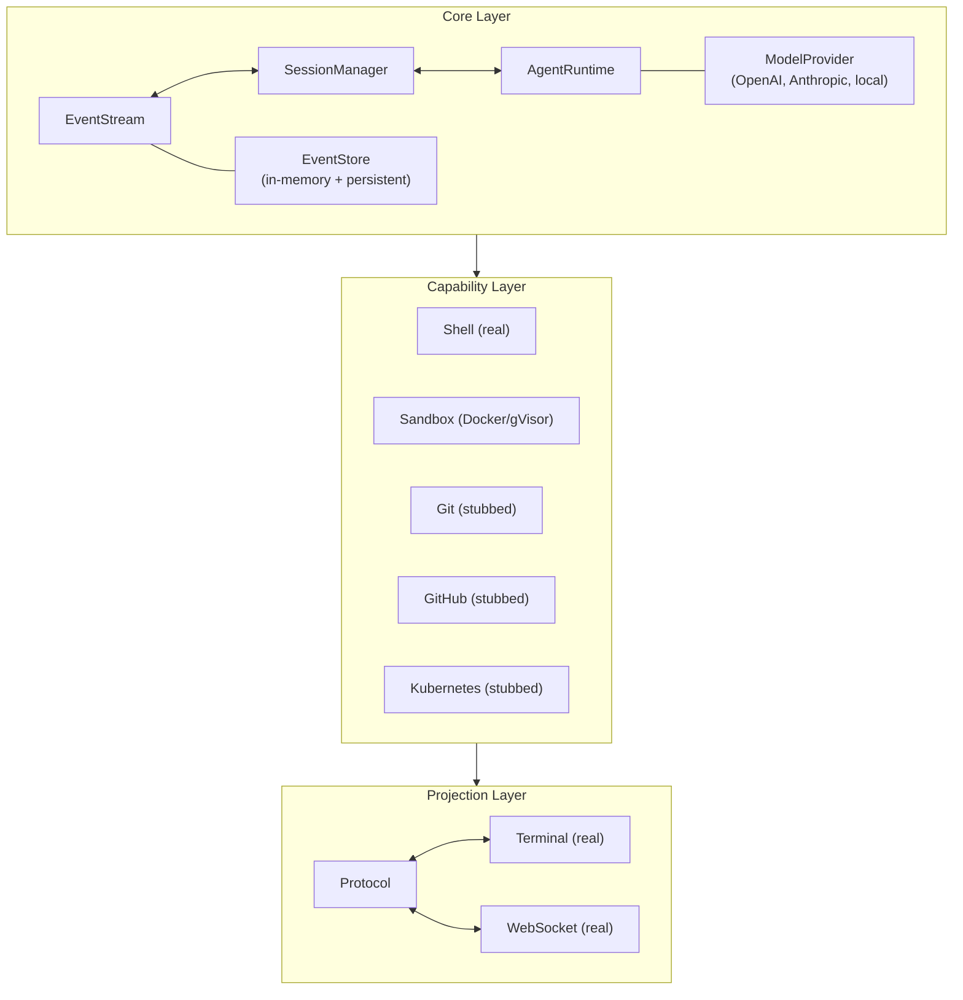
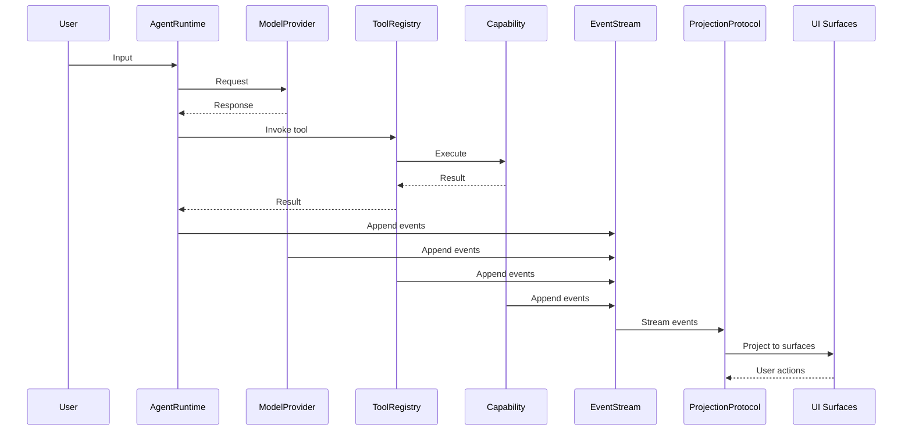

# Architecture

kayak-lab is built as a three-layer architecture: **Core**, **Capabilities**, and **Projections**.



## Core Layer

The foundation of the platform. Handles event storage, session lifecycle, and agent execution.

### EventStream

Immutable, append-only sequence of events. Events are strictly ordered by sequence number within a session. Different sessions are completely isolated.

```typescript
const stream = new EventStream();

// Append an event
const event = stream.append({
  session_id: "abc-123",
  event_type: "session.created",
  payload: { state: "active" },
  metadata: { source: "test" },
});

// Read events for a session
const events = stream.getEvents("abc-123");
```

### SessionManager

Manages session lifecycle with a state machine. All transitions emit typed events.

```typescript
const manager = new SessionManager(eventStream);

// Create a session
const session = await manager.createSession({ description: "My task" });

// Pause and resume
manager.pauseSession(session.id);
manager.resumeSession(session.id);

// Complete
manager.completeSession(session.id);
```

### AgentRuntime

The agent execution loop: input → model → tool cycle. Manages context windows and tool invocations.

```typescript
const runtime = new AgentRuntime(eventStream, sessionManager, modelManager, toolRegistry);

// Start and process input
await runtime.start();
const response = await runtime.processInput("Run ls -la");
```

### EventStore

In-memory event persistence with snapshot support. Stores events per session with range queries and replay capabilities. Can be used as a fast/ephemeral store, or swapped with the persistent store for durability.

```typescript
import { EventStore } from "./src/store/event-store.ts";

const store = new EventStore();

// Store an event
store.store(event);

// Read events
const events = store.getEvents("session-1");
const recent = store.getEventsInRange("session-1", 5, 10);

// Snapshots for fast replay
const snapshot = store.createSnapshot("session-1", { lastEventId: "abc" });
```

### PersistentEventStore

File-based event persistence with JSONL append-only logs, snapshot persistence, and startup recovery. Durably writes events to disk and reconstructs in-memory state on initialization, enabling sessions to survive process restarts and crashes.

```typescript
import { PersistentEventStore } from "./src/store/persistence.ts";

// Default: uses ./data/events/ directory
const store = new PersistentEventStore({ dataDir: "./data/events" });

// Custom directory
const store = new PersistentEventStore({ dataDir: "/var/lib/kayak/events" });

// Custom backend (e.g., SQLite in the future)
const store = new PersistentEventStore({
  dataDir: "./data/events",
  backend: new SQLitePersistenceBackend("./data/kayak.db"),
});

// Store events — written synchronously to JSONL on disk
store.store(event);

// Read events — served from in-memory cache (rebuilt from disk on startup)
const events = store.getEvents("session-1");
const recent = store.getEventsInRange("session-1", 5, 10);

// Snapshots — persisted to disk as JSON files
const snapshot = store.createSnapshot("session-1", { lastEventId: "abc" });

// Explicit flush (no-op for synchronous writes, available for future buffered backends)
store.flush();
```

**File layout:**

| File | Purpose |
|------|---------|
| `<session_id>.jsonl` | Append-only event log (one JSON object per line) |
| `<session_id>.snapshot.json` | Latest snapshot for fast recovery |

**Recovery behavior:**
- On startup, `PersistentEventStore` scans the data directory, loads snapshots, and replays events after the snapshot point.
- Corrupted lines are logged and skipped; valid events continue loading.
- Empty or missing data directory → clean start with no sessions.

**Pluggable backends:**

The `IPersistenceBackend` interface allows swapping storage engines without changing callers:

```typescript
interface IPersistenceBackend {
  write(sessionId: string, line: string): void;
  readLines(sessionId: string): string[];
  writeSnapshot(sessionId: string, data: Snapshot): void;
  readSnapshot(sessionId: string): Snapshot | undefined;
  listSessions(): string[];
  exists(sessionId: string): boolean;
}
```

The default `FilePersistenceBackend` uses synchronous Deno file I/O for guaranteed durability per write. Implement this interface for SQLite, PostgreSQL, or other backends.

### Schema Registry

Event schema versioning and migration. Registers schema versions per event type and migrates events on read.

```typescript
const registry = new SchemaRegistry();

// Register schema with migration
registry.register("session.created", 2, schemaV2, (event) => migrateV1toV2(event));

// EventStore uses registry for automatic migration
const store = new EventStore(undefined, registry);
```

### Health System

Component health reporting with parallel checks and Kubernetes-compatible endpoints.

```typescript
import { HealthRegistry, createHealthHandler } from "./src/core/health.ts";

const registry = new HealthRegistry();
registry.register("event-store", () => checkEventStore(store));
registry.register("capabilities", () => checkCapabilities(registry));

// Run all checks in parallel (1s timeout each)
const result = await registry.check();
// result.status: "healthy" | "degraded" | "unhealthy"

// HTTP endpoints
const handler = createHealthHandler(registry);
// GET /health  → full status (200/503)
// GET /ready   → readiness (200/503)
// GET /alive   → liveness (200)
```

### Configuration Management

YAML-based config loading with env var overrides and secret masking.

```typescript
import { loadConfig, validateConfig, maskSecrets } from "./src/core/config.ts";

// Load from config directory (precedence: env > file > defaults)
const config = await loadConfig("./config");

// Validate raw config
const result = validateConfig(rawObj);
if (!result.valid) {
  console.error(result.errors);
}

// Mask secrets in output
console.log(maskSecrets(config));
// { persistence: { dataDir: "/data" }, capabilities: { github: { token: "***" } } }
```

**Env var overrides:** `KAYAK_PERSISTENCE_DATA_DIR` → `config.persistence.dataDir`

### Rate Limiting

Token bucket rate limiter for external API calls. Smooths burst traffic while enforcing average rate.

```typescript
import { TokenBucket, RateLimiter } from "./src/core/rate-limiter.ts";

const bucket = new TokenBucket({
  capacity: 100,        // max burst
  refillRate: 10,       // tokens per interval
  refillIntervalMs: 1000,
});

const limiter = new RateLimiter(bucket);

// Wrap async function — throws on limit exceeded
const limitedFetch = limiter.wrap(fetch);
await limitedFetch("https://api.example.com");

// Or wait for tokens
const waitingFetch = limiter.wrapWithWait(fetch);
await waitingFetch("https://api.example.com"); // blocks until tokens available
```

### Bounded Queue

Queue with configurable overflow policies for backpressure handling.

```typescript
import { BoundedQueue } from "./src/core/bounded-queue.ts";

const queue = new BoundedQueue<Event>({
  maxSize: 1000,
  policy: "drop-oldest",  // or: drop-newest, block, reject
});

queue.push(event);
const next = queue.shift();
```

**Overflow policies:**

| Policy | Behavior |
|--------|----------|
| `drop-oldest` | Remove oldest item when full |
| `drop-newest` | Discard new item when full |
| `block` | Wait until space available |
| `reject` | Throw error when full |

### Reliability Patterns

Circuit breaker, retry, and fallback for fault tolerance.

```typescript
import { CircuitBreaker } from "./src/core/circuit-breaker.ts";
import { withRetry } from "./src/core/retry.ts";
import { executeWithFallback } from "./src/core/fallback.ts";

// Circuit breaker — opens after N failures
const breaker = new CircuitBreaker({ failureThreshold: 5, recoveryTimeMs: 30_000 });

// Retry with backoff
const result = await withRetry(fn, { maxRetries: 3, baseDelayMs: 100 });

// Fallback — try primary, fall back on failure
const result = await executeWithFallback(primaryFn, fallbackFn, breaker);
```

### Error Taxonomy

Typed error hierarchy with error codes and retryability.

```typescript
import { AppError, ValidationError, TimeoutError, RateLimitError } from "./src/core/errors.ts";

// All errors extend AppError
throw new ValidationError("Invalid input", { field: "name" });
throw new TimeoutError("Request timed out", { timeoutMs: 5000 });
throw new RateLimitError("Rate limited", { retryAfterMs: 60_000 });

// Error codes are unique strings
// AppError carries context, module, and operation
```

## Capability Layer

Abstract interfaces for external systems. Capabilities are pluggable and independently testable.

| Capability | Interface | Implementation |
|-----------|-----------|---------------|
| Shell | `IShellCapability` | Real — `Deno.Command` with safety constraints |
| Sandbox | `ISandboxRuntime` | Real — Docker/gVisor with hardened flags |
| Git | `IGitCapability` | Stubbed — simulated data |
| GitHub | `IGitHubCapability` | Stubbed — simulated data |
| Kubernetes | `IKubernetesCapability` | Stubbed — simulated data |

Capabilities follow a common pattern:

```typescript
interface ICapability {
  readonly definition: CapabilityDefinition;
  initialize(context: CapabilityContext): Promise<void>;
  dispose(): Promise<void>;
}

interface CapabilityResult<T> {
  success: boolean;
  data?: T;
  error?: string;
}
```

## Projection Layer

UI surfaces subscribe to the event stream and render events. Projections are independent — multiple can run simultaneously.

### Projection Protocol

Subscription management with event filtering, pause/resume, and reconnection support.

```typescript
const protocol = new ProjectionProtocol(eventStream);

// Subscribe to a session
const sub = protocol.subscribe("abc-123", (event) => {
  console.log(`[${event.event_type}]`, event.payload);
}, {
  filter: { event_types: ["tool.execution.started", "tool.execution.completed"] },
});

// Pause and resume
protocol.pause(sub.id);
protocol.resume(sub.id);
```

### Terminal Projection

ANSI-colored event rendering for CLI surfaces.

```typescript
const terminal = new TerminalProjection(protocol);
await terminal.start("abc-123");
```

### WebSocket Projection

Real-time event delivery to connected clients via WebSocket. Supports subscription management, gap recovery, and backpressure.

```typescript
import { WebSocketProjectionServer } from "./src/projection/websocket-server.ts";

const server = new WebSocketProjectionServer(eventStore, { port: 8080 });
await server.start();

// Clients connect via WebSocket, receive:
// - Welcome message with version and capabilities
// - Events matching their subscription filter
// - Gap recovery on reconnect
```

**Client messages:** `subscribe`, `unsubscribe`, `reconnect`, `pong`
**Server messages:** `welcome`, `event`, `error`, `ping`

## Data Flow



## Design Principles

1. **Events are the source of truth** — All state is derivable from events. No hidden mutable state.
2. **UI independence** — Agent runtime never knows about UI surfaces. Projections are disposable.
3. **Provider independence** — Model providers are abstracted. Swap without code changes.
4. **Capability independence** — External systems are abstracted. Test with mocks.
5. **Session isolation** — Events from different sessions never mix. Concurrent sessions are safe.
6. **Recovery by replay** — Any session state can be reconstructed from its event stream.
