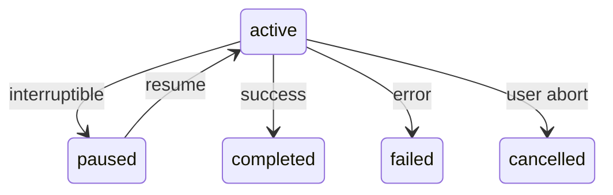

# Event Types

kayak-lab defines 25 event types across 7 categories. Every event conforms to the `BaseEvent` interface.

## BaseEvent

```typescript
interface BaseEvent {
  event_id: string;           // UUID
  session_id: string;         // Session this event belongs to
  sequence_number: number;    // Monotonically increasing within session
  timestamp: string;          // ISO 8601
  event_type: EventType;      // One of the 25 event types
  schema_version: number;     // Schema version for migration
  payload: Record<string, unknown>;  // Event-specific data
  metadata: {
    source: string;           // Origin component
    correlation_id?: string;  // Links related events
    user_id?: string;         // User who triggered this
  };
}
```

## Session Events

Lifecycle events for agent sessions.

| Event | Payload | Description |
|-------|---------|-------------|
| `session.created` | `{ state: "active", description? }` | New session started |
| `session.resumed` | `{ state: "active" }` | Paused session resumed |
| `session.paused` | `{ state: "paused" }` | Active session paused |
| `session.completed` | `{ state: "completed" }` | Session finished successfully |
| `session.failed` | `{ state: "failed", error? }` | Session failed with error |
| `session.cancelled` | `{ state: "cancelled" }` | Session cancelled by user |

### State Transitions



## Agent Events

Agent loop execution events.

| Event | Payload | Description |
|-------|---------|-------------|
| `agent.thinking` | `{ reasoning }` | Agent is reasoning about input |
| `agent.decision` | `{ decision, rationale }` | Agent decided on an action |
| `agent.tool_invocation` | `{ tool_name, arguments }` | Agent is invoking a tool |

## Tool Events

Tool execution tracking.

| Event | Payload | Description |
|-------|---------|-------------|
| `tool.execution.started` | `{ tool_call_id, tool_name, arguments }` | Tool execution began |
| `tool.execution.completed` | `{ tool_call_id, result, duration_ms }` | Tool execution succeeded |
| `tool.execution.failed` | `{ tool_call_id, error, duration_ms }` | Tool execution failed |

## Model Events

Model provider interaction.

| Event | Payload | Description |
|-------|---------|-------------|
| `model.request` | `{ messages, model?, temperature? }` | Request sent to model |
| `model.response` | `{ content, tool_calls, finish_reason }` | Model response received |
| `model.stream.delta` | `{ content?, tool_calls?, finish_reason? }` | Streaming delta chunk |

## UI Events

User interaction events.

| Event | Payload | Description |
|-------|---------|-------------|
| `ui.user.input` | `{ text, source }` | User sent input to agent |
| `ui.display.update` | `{ content, format }` | Agent updated display |
| `ui.action` | `{ action, parameters }` | User triggered an action |

## Policy Events

Policy enforcement (planned).

| Event | Payload | Description |
|-------|---------|-------------|
| `policy.approval` | `{ action, approver }` | Action approved by policy |
| `policy.denial` | `{ action, reason }` | Action denied by policy |
| `policy.constraint` | `{ constraint, scope }` | Policy constraint applied |

## Context Events

Context management.

| Event | Payload | Description |
|-------|---------|-------------|
| `context.window.updated` | `{ messages_added, messages_trimmed }` | Context window modified |
| `context.state.changed` | `{ key, old_value, new_value }` | Context state changed |

## Using Event Types

### Type Guards

```typescript
import { isSessionEvent, isToolEvent, isModelEvent } from "./src/types/events.ts";

if (isSessionEvent(event)) {
  // event.payload is typed as session event payload
}

if (isToolEvent(event)) {
  // event.payload is typed as tool event payload
}
```

### Filtering

```typescript
const protocol = new ProjectionProtocol(stream);

// Subscribe only to tool events
const sub = protocol.subscribe(sessionId, (event) => {
  console.log(`Tool: ${event.payload.tool_name}`);
}, {
  filter: {
    event_types: [
      "tool.execution.started",
      "tool.execution.completed",
      "tool.execution.failed",
    ],
  },
});
```

### Schema Versioning

All events carry a `schema_version` field. When event schemas change:

1. **Additive changes** (new optional fields) — bump minor version, backward compatible
2. **Breaking changes** (removed/renamed fields) — bump major version, requires migration

Current schema version: `1`
