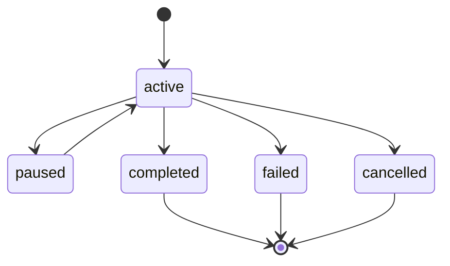

# Sessions

Sessions manage the lifecycle of agent interactions. Each session is an isolated container for events, context, and agent state.

## Session States



| State | Description | Terminal? |
|-------|-------------|-----------|
| `active` | Session is running, accepting input | No |
| `paused` | Session is suspended, can be resumed | No |
| `completed` | Session finished successfully | Yes |
| `failed` | Session failed with an error | Yes |
| `cancelled` | Session cancelled by user | Yes |

## Creating Sessions

```typescript
import { SessionManager } from "./src/core/session-manager.ts";

const manager = new SessionManager(eventStream);

// Create with defaults
const session = await manager.createSession();

// Create with description
const session = await manager.createSession({
  description: "Analyze codebase for security issues",
});

// Create with config
const session = await manager.createSession({
  description: "Run tests",
  config: { timeout_ms: 60000, model: "claude-3" },
});
```

## Session Lifecycle

### Pause and Resume

```typescript
// Pause an active session
manager.pauseSession(session.id);

// Resume a paused session
manager.resumeSession(session.id);
```

### Completion

```typescript
// Complete successfully
manager.completeSession(session.id);

// Fail with error
manager.failSession(session.id, new Error("Model API timeout"));
```

### Cancellation

```typescript
// Cancel by user
manager.cancelSession(session.id);
```

## Session Properties

```typescript
interface Session {
  id: string;                    // UUID
  state: SessionState;           // Current state
  created_at: string;            // ISO 8601
  updated_at: string;            // ISO 8601
  description?: string;          // Human-readable description
  config?: Record<string, unknown>;  // Session-specific configuration
}
```

## Event Emission

Every state transition emits a typed event:

| Transition | Event Emitted |
|-----------|--------------|
| Create | `session.created` |
| Pause | `session.paused` |
| Resume | `session.resumed` |
| Complete | `session.completed` |
| Fail | `session.failed` |
| Cancel | `session.cancelled` |

These events are appended to the EventStream and are available for replay, projection, and audit.

## Recovery

Sessions can be recovered from their event stream after a crash:

1. Load events for the session from the EventStore
2. Replay events to reconstruct session state
3. Resume from the last known state

```typescript
// Replay events to reconstruct state
const events = eventStore.getEvents(sessionId);
const lastEvent = events[events.length - 1];

// The last event's payload contains the session state
if (lastEvent.event_type === "session.paused") {
  // Session was paused before crash — can resume
  manager.resumeSession(sessionId);
}
```

## Session Isolation

Events from different sessions are completely isolated:

```typescript
// Events from session A
stream.append({ session_id: "A", event_type: "ui.user.input", ... });

// Events from session B
stream.append({ session_id: "B", event_type: "ui.user.input", ... });

// Reading session A — only sees A's events
stream.getEvents("A"); // [event-A1, event-A2, ...]

// Reading session B — only sees B's events
stream.getEvents("B"); // [event-B1, event-B2, ...]
```

Concurrent sessions are safe — each maintains its own independent event sequence.
